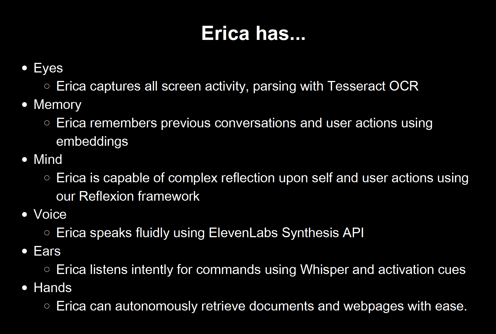

# Erica: An OS-level program for in-context inference written in Rust and Python

Written in 6 hours by [Peter Bowman-Davis](https://phbd.xyz/) and [Noah Shinn](https://noahshinn.com) for 2nd place at the NYC LLM Hackathon backed by OpenAI, Anthropic, and several others.



### What can Erica do for you?

##### Why is Erica helpful?
She learns about your actions in the background so that you don't have to provide context in your API calls. She knows everything that you know, and more. OpenAI and others have pushed powerful interfaces that have saved much time for their users, but the users' expectations are growing. Now, users don't have to copy and paste context to their interface of choice. Erica already knows everything that you are thinking.
  - `"Hey Erica, can you write the rest of this email for me?"`
Sure! I see that you're drafting an email to Peter about a recent paper that you saw. I also see that you're reading a paper abstract on the right. I see the link so I'll grab the full document, parse it, and then summarize for your email.
  - `"Erica, can you read this paper and create a podcast from it? Speak it out loud to me."`
(In her voice) Ok give me a sec. I'm grabbing the content from the link that I can see in your Chrome window. Here's the podcast ...
  - `"Erica, what have we been working on for the past 10 minutes? Use your voice please."`
(In her voice) Well, you've been browsing several articles about actor critic reinforcement learning papers. You've asked me to write an email to Peter with a summary of a paper and you've asked me to create a podcast for you.
  - `"Erica, remember that GAN that I was writing about 5 minutes ago? Can you finish the forward pass implementation?"`
<p>
Sure! Here's the completed code for the forward pass of the Discriminator:
</p>

```python
class Discriminator(nn.Module):
    def __init__(self, in_image):
        super(Discriminator, self).__init__()
        self.fc1 = nn.Linear(in_image, 128)
        self.fc2 = nn.Linear(128, 1)
        self.relu = nn.LeakyReLU(0.01)
        self.sigmoid = nn.Sigmoid()

    def forward(self, x):
        x = self.fc1(x)
        x = self.relu(x)
        x = self.fc2(x)
        x = self.sigmoid(x)
        return x
```

### WARNING
  - There is a reason why Erica is very helpful. She can see everything that you are doing. She can self-reflect on your collaborative actions and form new ideas. Don't start Erica if you don't want her to learn about you. When you start Erica, you start a live experience with her, which is subject to its advantages and disadvantages.

  - If you have any questions, send messages to `noahshinn024@gmail.com` and `peter.bowman-davis@yale.edu`.

### NOTE
  - This is an open-source project that is intended to grow into a collaborative, self-aware operating system in the future.


### Installation
  - Requires:
    - `Rust`
    - [Tesseract](https://tesseract-ocr.github.io/tessdoc/Installation.html)
    - [Leptonica](http://www.leptonica.org/)
    - On Linux, you need `libxcb`, `libxrandr`, and `dbus`
  - Clone this repo:
```bash
git clone https://github.com/noahshinn024/erica
```
  - Run `make` in this directory to build `erica-watch`. See the source code in `./erica-watch`.
```bash
cd ./erica && make
```
  - Set an OpenAI API key for Erica's text generation
```bash
export OPENAI_API_KEY="<your openai api key>"
```
  - Set an Eleven Labs API key for Erica's voice
```bash
export ELEVENLABS_API_KEY="<your eleven labs api key>"
```
